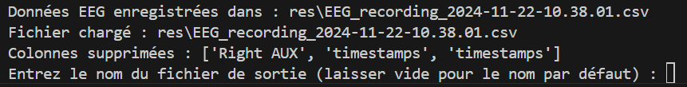

# VR EEG Project - Collecting and Processing EEG Data with Muse 2

Features for this version :  
This project allows you to collect EEG data from a **Muse 2** device, process it to remove unnecessary columns, and save the modified data into a CSV file.  
The project is not yet complete and is still under development. New features will be added shortly.  



---

## **Prerequisites**

Before running the project, ensure your environment is properly configured.

### **Required Hardware**
- A **Muse 2** device, properly configured and functional.
- A computer capable of running Python.

### **Required Software**
1. **Python 3.8 or later**
   - Download Python [here](https://www.python.org/downloads/).

2. **Muselsl** (Muse Lab Streaming Library)
   - Install Muselsl, a tool to interact with Muse devices:
     ```bash
     pip install muselsl
     ```

3. **Pandas**
   - A library for processing CSV files:
     ```bash
     pip install pandas
     ```

4. **Additional Tools**
   - `shutil`, `os`, and `subprocess` are Python standard libraries, included by default.

---

## **Project Structure**

```
project/
│
├── main.py                 # Main entry point of the project
├── controller/
│   └── muse_controller.py  # Controller orchestrating the models
├── model/
│   ├── csv_rewriter.py     # Model for processing CSV files
│   └── eeg_recorder.py     # Model for collecting EEG data
└── view/
    └── renderer.py         # View (currently minimal)
```

### **Functionality of Each File**
1. **`main.py`** :
   - Entry point of the program. Initializes and runs the controller.

2. **`controller/muse_controller.py`** :
   - Manages the main application flow:
     - Collects EEG data.
     - Loads data into a CSV model.
     - Removes unnecessary columns.
     - Saves the modified file.

3. **`model/eeg_recorder.py`** :
   - Handles communication with the Muse 2 device to collect EEG data.
   - Identifies and moves the generated file into a specific folder (`res`).

4. **`model/csv_rewriter.py`** :
   - Loads a CSV file generated by Muse 2.
   - Allows removing unnecessary columns and saving a new file.

5. **`view/renderer.py`** :
   - Placeholder for displaying or interacting with the user interface (currently minimal).

---

## **How to Run the Project**

### **1. Clone or Download the Project**
Clone the repository or download the files into a local folder.

### **2. Install Dependencies**
Ensure the necessary libraries are installed:
```bash
pip install muselsl pandas
```

### **3. Connect Your Muse 2 Device**
- Ensure your Muse 2 device is powered on and ready to use.
- Verify the device is detected by running:
  ```bash
  muselsl stream
  ```

### **4. Run the Program**
In the folder containing `main.py`, execute the following command:
```bash
python main.py
```

---

## **How It Works**

### **Main Steps:**

1. **Collecting EEG Data** :
   - The program starts an EEG stream using `muselsl stream`.
   - It then executes `muselsl record` to record 60 seconds of data into a CSV file.

2. **Loading the Data** :
   - The generated file is loaded into a `pandas.DataFrame`.

3. **Processing the Data** :
   - Unnecessary columns are removed, including:
     - The first column (often unnamed).
     - `Right AUX` and `timestamps`.

4. **Saving the Data** :
   - The user can save the processed data into a CSV file with a custom name.

---

## **Output Folder Structure**

Generated files are saved into a folder named `res/`:
- Raw files generated by `muselsl`.
- Processed files after modifications.

---

## **Troubleshooting**

### **1. Command Not Found**
If you encounter an error stating `muselsl` is not recognized, install it using:
```bash
pip install muselsl
```

### **2. No EEG File Generated**
- Ensure your Muse 2 device is powered on and detected.
- Test `muselsl record` to verify data is being recorded.

### **3. Permissions**
If the `res/` folder cannot be created or written to, run the program with administrative permissions:
```bash
sudo python main.py  # Linux/macOS
python main.py       # Windows (ensure you are an administrator)
```

---

## **Contributing**

Contributions are welcome! If you have ideas or want to add features, feel free to submit a pull request.

---

## **Author**

- **Arthur Deroo**  
- **Contact:** [arthur.deroo@edu.devinci.fr](mailto:arthur.deroo@edu.devinci.fr)
